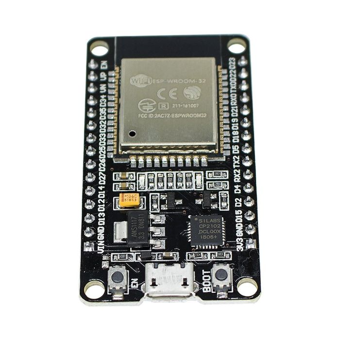

# 🌱 Monitoramento de Umidade de Planta – ESP32

Firmware para o ESP32 que lê um sensor de umidade do solo resistivo (higrômetro) e disponibiliza os dados via servidor HTTP.  Funciona em conjunto com o frontend React (https://github.com/nandacoimbra/controle-umidade-react) para exibir leituras de umidade do solo a cada 15 min, ou quando o usuário solicitar.

## Funcionalidades

- Conexão do ESP32 ao Wi-Fi
- Servidor HTTP embutido (porta 80)
- Endpoint `/umidade` para leitura atual (analógica) do sensor + timestamp
- Endpoint `/historico` para retornar todo o histórico de leitura salvo no SPIFFS (memória flash)
- Endpoint `/limpar` (POST) para apagar todos os registros do histórico
- Armazenamento dos dados (umidade + timestamp) no SPIFFS (`/historico.txt`)
- Uso de NTP (Network Time Protocol) para sincronizar a data e hora
- Respostas em JSON para fácil consumo pelo frontend React

## Hardware Necessário

- ESP32 DevKit (qualquer modelo compatível)
- Sensor de umidade do solo
- Conexão Wi-Fi

## Estrutura do Código

- **Leitura do sensor:** `analogRead(pinoSensorUmidade)`  

### Endpoints

- `GET /umidade` → Retorna leitura atual + timestamp  
- `GET /historico` → Retorna um array JSON com todas as leituras salvas  
- `POST /limpar` → Limpa o histórico em memória e no SPIFFS

## Como Usar

1. Hardware

- Fazer a ligação entre o ESP32 (ou outra placa de prototipagem, ex: Arduino) e o sensor de umidade de solo

- Sensor de umidade de solo


- Esp32 DEVKIT V1


2. Clonar este repositório  
```bash
git clone https://github.com/nandacoimbra/controle-de-umidade-esp32.git
cd controle-de-umidade-esp32
```
3. Configurar Wi-Fi

No arquivo secrets.h, informe seu SSID e senha:
```bash
#define WIFI_SSID "SeuWiFi"
#define WIFI_PASSWORD "SuaSenha"

```
4. Instalar Bibliotecas Necessárias no Arduino IDE ou PlatformIO
- WiFi.h
- WebServer.h
- ESPmDNS.h
- SPIFFS.h
- NTPClient.h
- WiFiUdp.h

5. Upload do Código
- Conecte o ESP32 ao PC
- Abra o projeto no Arduino IDE ou VS Code + PlatformIO
- Selecione a porta correta e faça upload

6. Acessar o Servidor

Você pode acessar via:

- `http://<IP_do_ESP>/umidade`
- `http://<IP_do_ESP>/historico`
- `http://<IP_do_ESP>/limpar` (requisição POST)